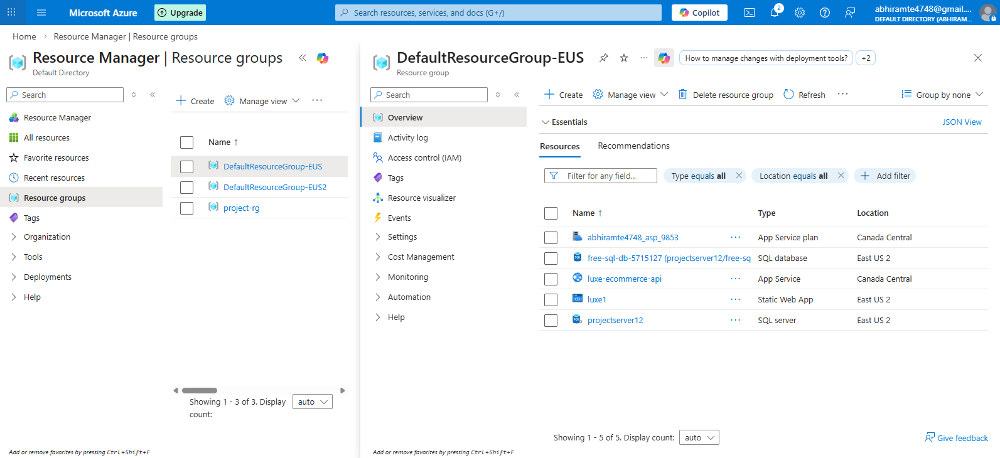
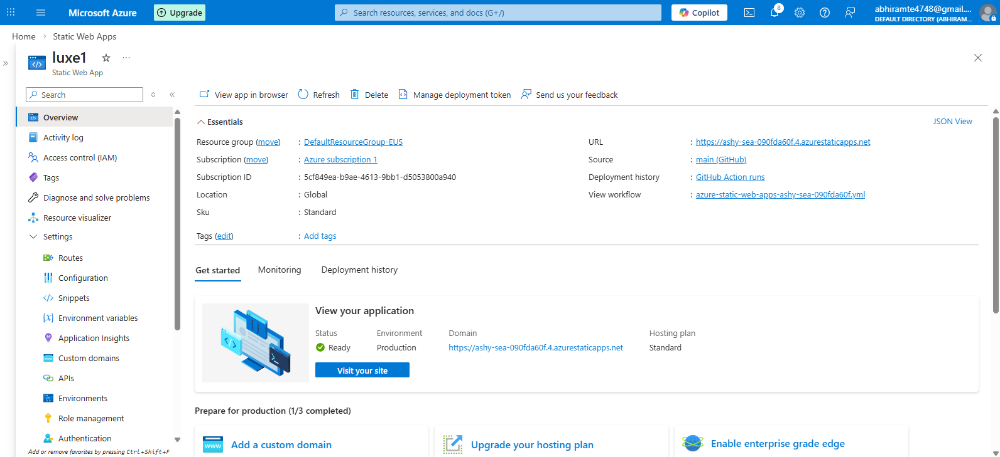
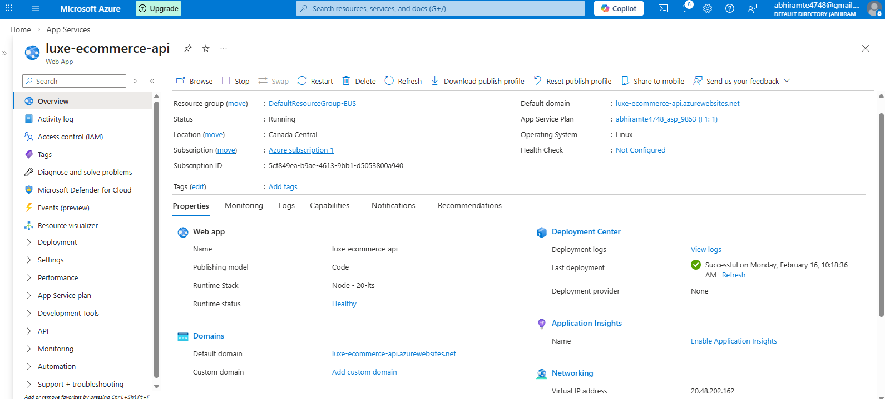

# ☁️ Azure Full-Stack E-Commerce Web Application

A complete **cloud-hosted full-stack E-Commerce platform** built using **React, Node.js, Express, and Microsoft Azure SQL Database**, and deployed entirely on **Microsoft Azure Cloud Services**.

This project demonstrates real-world cloud architecture where a frontend client communicates with a backend REST API which securely connects to a managed cloud database.

---

## 🌐 Live Application

**Frontend (Azure Static Web App)**
https://ashy-sea-090fda60f.4.azurestaticapps.net/

**Backend API (Azure App Service)**
https://luxe-ecommerce-api.azurewebsites.net/

---

## 🧠 Project Architecture

User Browser → React Frontend → Node/Express Backend → Azure SQL Database

The frontend **never directly accesses the database**.
All database operations are securely handled by the backend API.

---

## 📸 Azure Deployment Proof (Screenshots)

### Resource Group



All Azure services (Static Web App, App Service, SQL Database) are organized inside a single Azure Resource Group.

---

### Azure Static Web App (Frontend Hosting)



The React frontend is deployed using Azure Static Web Apps with automatic CI/CD deployment through GitHub Actions.

---

### Azure App Service (Backend API)



The Node.js + Express backend REST API is hosted on Azure App Service and handles authentication, cart operations, and order processing.

---

### Azure SQL Database Server


Microsoft Azure SQL Database stores products, users, carts, and order history. The backend connects securely using environment variables.

---

## 🚀 Features

### User Features

* Browse products
* Product detail view
* Select size (S, M, L, XL)
* Add to cart
* Checkout system
* Place orders
* View order history
* Persistent login (local storage authentication)

### Data & Backend Features

* Products stored in Azure SQL
* Order tracking
* Cart storage
* Stock management by size
* User profile storage
* REST API architecture

---

## 🛠️ Technology Stack

### Frontend

* React (Vite)
* React Router DOM
* Context API (state management)
* Tailwind CSS

### Backend

* Node.js
* Express.js
* CORS
* dotenv
* mssql (Microsoft SQL Server driver)

### Database

* Microsoft Azure SQL Database

### Cloud & DevOps

* Azure Static Web Apps (Frontend Hosting)
* Azure App Service (Backend Hosting)
* Azure SQL Database (Managed Cloud Database)
* GitHub Actions (CI/CD Deployment)

---

## 📂 Project Structure

```
AWS_WEB/
│
├── src/                 # React Frontend
├── public/
├── dist/                # Production Build
│
├── server/              # Backend (Node.js API)
│   ├── server.js
│   ├── setup_complete_db.sql
│   └── .env
│
├── screenshots/         # Azure proof images
├── package.json
├── vite.config.js
└── README.md
```

---

## ⚙️ Local Setup Instructions

### 1️⃣ Clone Repository

```
git clone https://github.com/<your-username>/<repo-name>.git
cd <repo-name>
```

---

### 2️⃣ Install Frontend

```
npm install
npm run dev
```

Frontend runs at:

```
http://localhost:5173
```

---

### 3️⃣ Setup Backend

```
cd server
npm install
```

Create `.env` file:

```
DB_SERVER=yourserver.database.windows.net
DB_NAME=yourdatabase
DB_USER=yourusername
DB_PASSWORD=yourpassword
PORT=3000
```

Run backend:

```
node server.js
```

Backend runs at:

```
http://localhost:3000
```

---

## 🗄️ Database Setup

1. Open Azure Portal
2. Go to **SQL Database**
3. Open **Query Editor**
4. Run:

```
server/setup_complete_db.sql
```

This creates:

* Products
* ProductSizes
* Cart
* Orders
* OrderItems
* Users tables

---

## 🔐 Environment Variables

### Backend (.env)

```
DB_SERVER=
DB_NAME=
DB_USER=
DB_PASSWORD=
PORT=3000
```

### Frontend (Azure Static Web App → Configuration → Application Settings)

```
VITE_API_URL=https://luxe-ecommerce-api.azurewebsites.net
```

---

## ☁️ Deployment

### Frontend

* Hosted using Azure Static Web Apps
* Automatically deployed via GitHub Actions on push to `main`

### Backend

Deployed using Azure CLI:

```
az webapp up --name luxe-ecommerce-api --resource-group DefaultResourceGroup-EUS --runtime "NODE|20-lts"
```

---

## 🔌 REST API Endpoints

| Method | Endpoint        | Description        |
| ------ | --------------- | ------------------ |
| GET    | /products       | Get all products   |
| GET    | /products/:id   | Get single product |
| POST   | /cart           | Add to cart        |
| POST   | /orders         | Place order        |
| GET    | /orders/:userId | Order history      |
| POST   | /users          | Create user        |

---

## 📊 Learning Outcomes

This project demonstrates:

* Full-stack web development
* Cloud deployment on Microsoft Azure
* REST API architecture
* SQL database integration
* CI/CD pipelines
* Secure backend-database communication
* Environment configuration
* CORS handling

---

## ⚠️ Important Notes

* The frontend never directly connects to the database.
* All data passes through the backend API.
* Azure firewall rules allow backend access only.
* Credentials are stored using environment variables (not hardcoded).

---

## 👨‍💻 Author

**Abhiram T E**

Major Project
Full-Stack Cloud Web Application Deployment using Microsoft Azure

---

## 📜 License

This project is created for academic and educational purposes.
