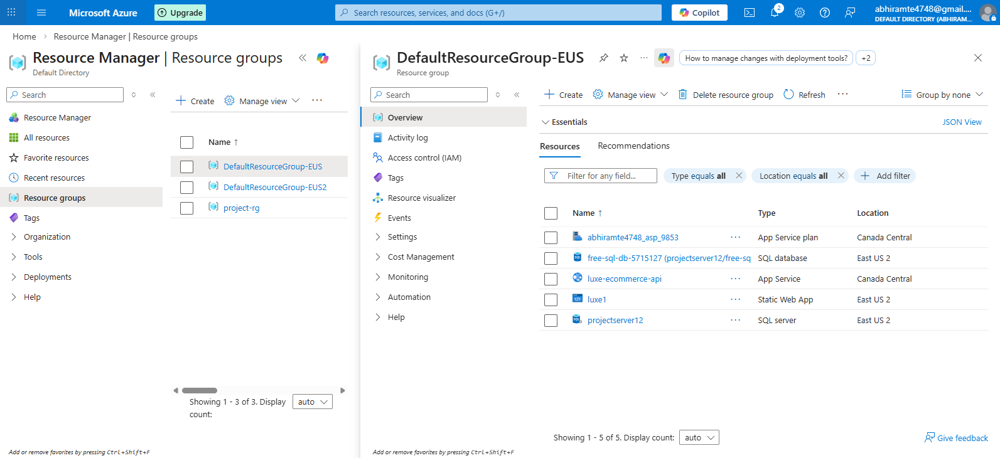
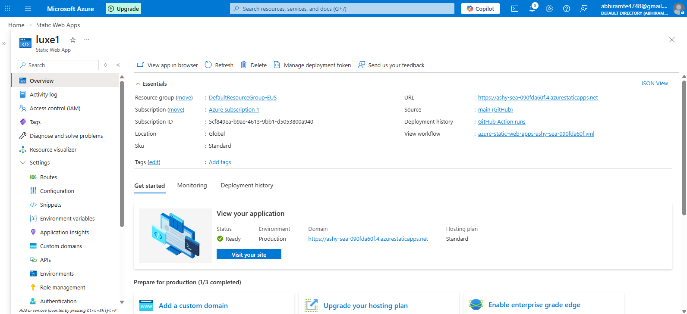
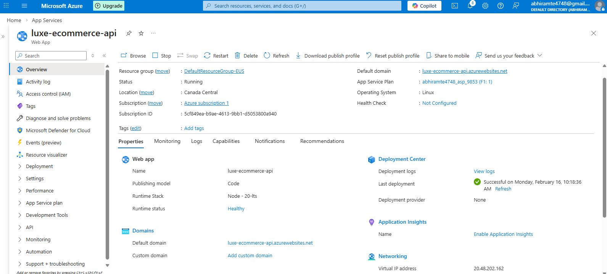
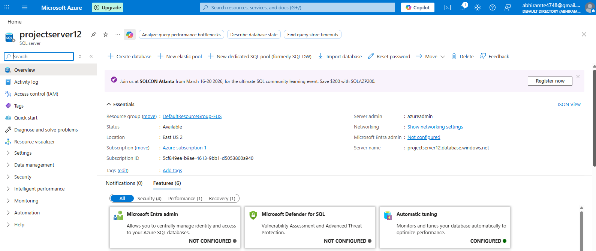

<div align="center">

# 🛍️ Luxe — Full-Stack E-Commerce on Azure

### React · Node.js · Express · Azure SQL · CI/CD

[](https://azure.microsoft.com/)
[](https://react.dev/)
[](https://nodejs.org/)
[](https://azure.microsoft.com/en-us/products/azure-sql/)
[](https://github.com/features/actions)
[](LICENSE)

<br/>

> A production-grade, cloud-native e-commerce platform where every layer — frontend, backend, and database — is deployed and managed entirely on **Microsoft Azure**.

<br/>

| 🌐 Frontend | ⚙️ Backend API |
|:---:|:---:|
| [ashy-sea-090fda60f.4.azurestaticapps.net](https://ashy-sea-090fda60f.4.azurestaticapps.net/) | [luxe-ecommerce-api.azurewebsites.net](https://luxe-ecommerce-api.azurewebsites.net/) |
| Azure Static Web Apps | Azure App Service |

</div>

---

## 📑 Table of Contents

- [Overview](#-overview)
- [Architecture](#-architecture)
- [Azure Services](#-azure-services)
- [Features](#-features)
- [Tech Stack](#-tech-stack)
- [Project Structure](#-project-structure)
- [Local Setup](#-local-setup)
- [Database Setup](#-database-setup)
- [Environment Variables](#-environment-variables)
- [Deployment](#-deployment)
- [API Reference](#-api-reference)
- [Screenshots](#-screenshots)
- [Security](#-security-design)
- [Learning Outcomes](#-learning-outcomes)
- [Author](#-author)

---

## 🔍 Overview

**Luxe** is a full-stack e-commerce web application built to demonstrate real-world cloud deployment on Microsoft Azure. It covers the complete software stack — a responsive React storefront, a secure RESTful Node.js/Express API, and a managed Azure SQL relational database — all wired together and deployed to the cloud with automated CI/CD pipelines.

The architecture enforces a strict separation of concerns: the frontend **never** touches the database directly. Every data operation flows through the backend API, which handles validation, business logic, and secure database access.

---

## 🏗️ Architecture

```
┌──────────────────────────────────────────────────────────────────────────┐
│                            User Browser                                  │
└────────────────────────────────┬─────────────────────────────────────────┘
                                 │  HTTPS
                                 ▼
┌──────────────────────────────────────────────────────────────────────────┐
│             Azure Static Web App  (React + Vite)                         │
│                                                                          │
│  • Global CDN delivery          • Auto CI/CD via GitHub Actions          │
│  • HTTPS by default             • SPA routing support                    │
└────────────────────────────────┬─────────────────────────────────────────┘
                                 │  REST API Calls (HTTPS/JSON)
                                 ▼
┌──────────────────────────────────────────────────────────────────────────┐
│             Azure App Service  (Node.js + Express REST API)              │
│                                                                          │
│  • Authentication logic         • Cart & order management                │
│  • CORS enforcement             • Environment-variable config            │
│  • Input validation             • Business logic layer                   │
└────────────────────────────────┬─────────────────────────────────────────┘
                                 │  mssql driver (TLS encrypted)
                                 ▼
┌──────────────────────────────────────────────────────────────────────────┐
│             Azure SQL Database  (Managed Relational DB)                  │
│                                                                          │
│  Products │ ProductSizes │ Cart │ Orders │ OrderItems │ Users            │
│                                                                          │
│  • Azure firewall rules         • Automated backups                      │
│  • TLS-encrypted connections    • 99.99% SLA                             │
└──────────────────────────────────────────────────────────────────────────┘
```

**Data flow:** Browser → Static Web App → App Service API → Azure SQL  
No direct browser-to-database connection exists at any point.

---

## ☁️ Azure Services

| Azure Service | Tier | Role |
|---|---|---|
| **Azure Static Web Apps** | Free | React frontend hosting + global CDN |
| **Azure App Service** | B1 (Basic) | Node.js/Express REST API hosting |
| **Azure SQL Database** | Standard S0 | Managed relational database |
| **Azure Resource Group** | — | Logical container for all services |
| **GitHub Actions** | — | Automated build & deploy pipeline |

All services are co-located inside a single **Azure Resource Group** for unified billing, access management, and lifecycle control.

---

## 🚀 Features

### 🛒 Storefront
- Browse full product catalogue
- Product detail pages with descriptions and images
- Size selector (S / M / L / XL) with stock awareness
- Add to cart with real-time quantity management
- Checkout and order placement flow
- Order history per user account

### 🔧 Backend & Data
- Full REST API with JSON responses
- Products, sizes, and stock stored in Azure SQL
- Per-user cart persistence
- Order tracking with line-item breakdown
- User profile creation and persistent login via local storage
- Secure environment variable configuration (no hardcoded secrets)

---

## 🛠️ Tech Stack

### Frontend
| Technology | Purpose |
|---|---|
| React (Vite) | UI framework and build tooling |
| React Router DOM | Client-side SPA routing |
| Context API | Global state management (cart, auth) |
| Tailwind CSS | Utility-first styling |

### Backend
| Technology | Purpose |
|---|---|
| Node.js | Runtime environment |
| Express.js | REST API framework |
| mssql | Azure SQL Server driver |
| CORS | Cross-origin request handling |
| dotenv | Environment variable management |

### Cloud & DevOps
| Service | Purpose |
|---|---|
| Azure Static Web Apps | Frontend hosting + CDN |
| Azure App Service | Backend API hosting |
| Azure SQL Database | Managed relational database |
| GitHub Actions | CI/CD — auto-deploy on push to `main` |

---

## 📂 Project Structure

```
luxe-ecommerce/
│
├── 📁 src/                        # React frontend source
│   ├── components/                # Reusable UI components
│   ├── pages/                     # Route-level page components
│   ├── context/                   # Cart & auth context providers
│   └── main.jsx                   # App entry point
│
├── 📁 public/                     # Static assets
├── 📁 dist/                       # Production build output (Vite)
│
├── 📁 server/                     # Node.js backend
│   ├── server.js                  # Express app + all API routes
│   ├── setup_complete_db.sql      # Full database schema script
│   └── .env                       # Local environment variables (git-ignored)
│
├── 🖼️  resourse_group.png          # Azure deployment screenshot
├── 🖼️  static_web_app.png          # Azure deployment screenshot
├── 🖼️  App_service.png             # Azure deployment screenshot
├── 🖼️  SQL_project_server.png      # Azure deployment screenshot
│
├── package.json                   # Frontend dependencies
├── vite.config.js                 # Vite configuration
└── README.md
```

---

## ⚙️ Local Setup

### Prerequisites
- Node.js v18+ and npm
- Access to an Azure SQL Database instance (or local SQL Server)
- Git

---

### 1 — Clone the Repository

```bash
git clone https://github.com/<your-username>/luxe-ecommerce.git
cd luxe-ecommerce
```

---

### 2 — Run the Frontend

```bash
npm install
npm run dev
```

Runs at: **`http://localhost:5173`**

---

### 3 — Run the Backend

```bash
cd server
npm install
```

Create a `.env` file inside `server/`:

```env
DB_SERVER=yourserver.database.windows.net
DB_NAME=yourdatabase
DB_USER=yourusername
DB_PASSWORD=yourpassword
PORT=3000
```

```bash
node server.js
```

Runs at: **`http://localhost:3000`**

> 💡 Make sure your local IP is added to the Azure SQL **firewall rules** to allow connections during development.

---

## 🗄️ Database Setup

1. Open the [Azure Portal](https://portal.azure.com)
2. Navigate to your **SQL Database** resource
3. Open the **Query Editor** (in the left panel)
4. Authenticate with your SQL credentials
5. Open and execute: `server/setup_complete_db.sql`

This script creates all required tables:

| Table | Description |
|---|---|
| `Users` | Registered user accounts |
| `Products` | Product catalogue |
| `ProductSizes` | Size variants and stock levels |
| `Cart` | Per-user active cart items |
| `Orders` | Placed order headers |
| `OrderItems` | Line items per order |

---

## 🔐 Environment Variables

### Backend — `server/.env`

```env
DB_SERVER=        # e.g. yourserver.database.windows.net
DB_NAME=          # Azure SQL database name
DB_USER=          # SQL admin username
DB_PASSWORD=      # SQL admin password
PORT=3000
```

> ⚠️ Never commit `.env` to version control. Add it to `.gitignore`.

### Frontend — Azure Static Web App Settings

Configure in: **Azure Portal → Static Web App → Configuration → Application Settings**

```
VITE_API_URL = https://luxe-ecommerce-api.azurewebsites.net
```

---

## 🚢 Deployment

### Frontend — Azure Static Web Apps (Auto CI/CD)

The frontend deploys automatically on every push to `main` via **GitHub Actions**.

A `.github/workflows/azure-static-web-apps-*.yml` file is auto-generated by Azure during setup. No manual deployment step is needed after the initial link.

### Backend — Azure App Service (Azure CLI)

```bash
az webapp up \
  --name luxe-ecommerce-api \
  --resource-group DefaultResourceGroup-EUS \
  --runtime "NODE|20-lts"
```

> Run this from the `server/` directory. Azure CLI packages and deploys the backend directly.

---

## 🔌 API Reference

Base URL: `https://luxe-ecommerce-api.azurewebsites.net`

| Method | Endpoint | Description |
|---|---|---|
| `GET` | `/products` | Retrieve all products |
| `GET` | `/products/:id` | Retrieve a single product by ID |
| `POST` | `/users` | Register a new user |
| `POST` | `/cart` | Add item to cart |
| `GET` | `/cart/:userId` | Get cart for a user |
| `DELETE` | `/cart/:itemId` | Remove item from cart |
| `POST` | `/orders` | Place a new order |
| `GET` | `/orders/:userId` | Get order history for a user |

All endpoints accept and return **JSON**. The API enforces CORS to allow requests only from the deployed frontend origin.

---

## 📸 Screenshots

### Azure Resource Group


### Azure Static Web App (Frontend)


### Azure App Service (Backend API)


### Azure SQL Database Server


---

## 🔒 Security Design

| Concern | Implementation |
|---|---|
| **No direct DB access** | Frontend communicates only with the backend API |
| **Encrypted connections** | All API calls and DB connections use TLS/HTTPS |
| **Secret management** | Credentials stored in environment variables, never in source code |
| **Firewall rules** | Azure SQL configured to accept connections from App Service only |
| **CORS policy** | Backend restricts cross-origin requests to the frontend domain |
| **No hardcoded credentials** | `.env` file is git-ignored; Azure App Settings used in production |

---

## 🎓 Learning Outcomes

This project demonstrates practical application of:

- **Full-stack development** — end-to-end integration of React frontend, Node/Express backend, and SQL database
- **Microsoft Azure** — provisioning and connecting Static Web Apps, App Service, and Azure SQL within a Resource Group
- **REST API design** — resource-oriented routing, JSON communication, and separation of concerns
- **CI/CD pipelines** — automated deployment to Azure on every GitHub push via GitHub Actions
- **Cloud security** — environment variable management, firewall rules, CORS, and TLS enforcement
- **Relational database design** — normalized schema across 6 tables with foreign key relationships

---

## 👨‍💻 Author

**Abhiram T E**

[](https://github.com/abhiram4748)

---

<div align="center">

*Major Project — Full-Stack Cloud Web Application Deployment using Microsoft Azure*

**⭐ Star this repo if it helped you understand cloud-native full-stack development!**

</div>
